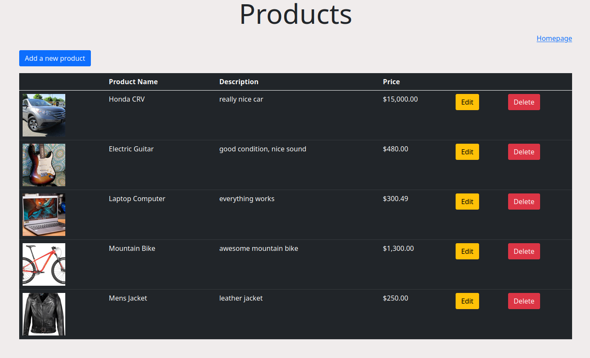
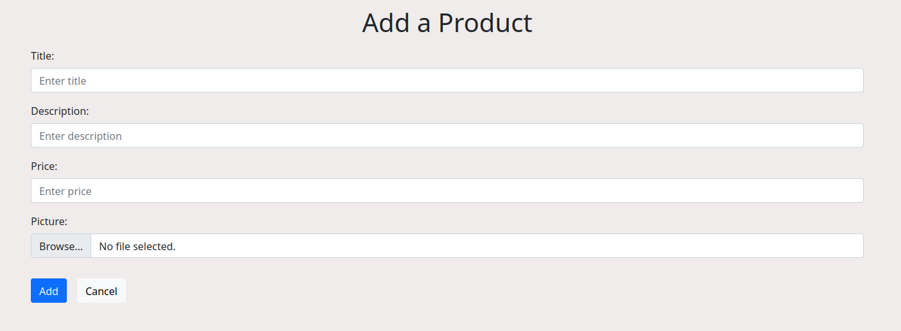
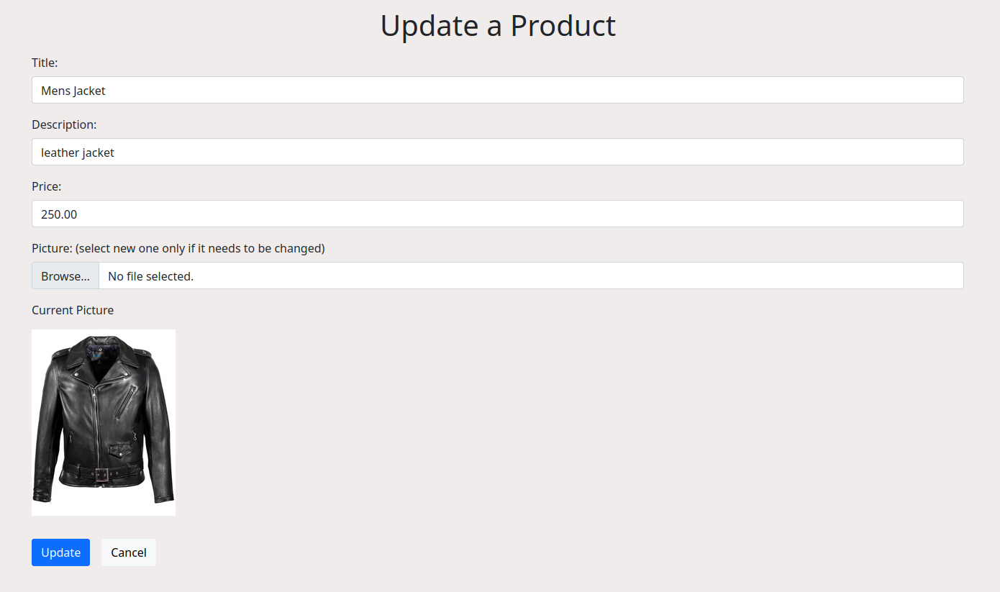

# React Express E-Commerce Admin Page with CRUD

## Table of Contents
---
- [Overview](#overview)
- [Built with](#built-with)
- [Features](#features)
- [Things To Be Improved](#things-to-be-improved)

## Overview
---

This is a simple e-commerce admin app with CRUD. The admin can add, edit and 
delete a product with a picture. 
Passing a image file with other string variables to backend took me a white to figure out. To pass dataForm, it was needed to put string variables in javascript object, then converting it into a JSON format and a Blob file. This was a good project to learn a simple full stack with CRUD. 

&nbsp;
### Built With

#### Frontend:
- [React](https://reactjs.org/)
- [Bootstrop 5](https://getbootstrap.com/)

#### Backend:
- [Express](https://expressjs.com/)

#### SQL:
- [PostgreSQL](https://www.postgresql.org/)

## Features
---
Anyone can manage the product list without any technical knowledge

## Things To Be Improved
----
1. Using authentication to access the admin page
2. Adding 'sort by' on the product list page (main page) so that customers can sort by price or latest added

